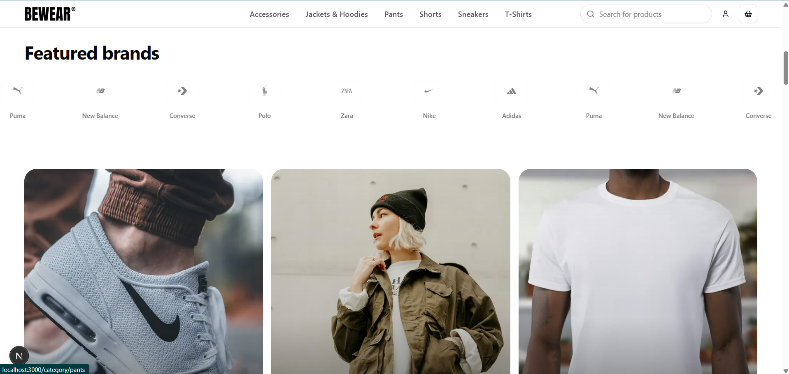

<div align="center">

# BEWEAR

**Premium streetwear & sneakers — a full-stack e-commerce built for the US market.**

Next.js 15 · React 19 · TypeScript · Drizzle ORM · PostgreSQL (Neon) · Tailwind v4 · shadcn/ui · Stripe · Better Auth

<br/>



<sub>Home page — editorial hero, brand marquee and feature cards (Nike-grade UI).</sub>

</div>

> ⚠️ **Work in progress.** This is a living document, updated as the project evolves toward a
> Nike-grade front-end experience. A final, portfolio-ready version (with live demo, screenshots and
> architecture diagram) will ship once the build is complete.

---

## Overview

BEWEAR is a modern fashion/streetwear store. The goal is a **premium front-end** on par with
[nike.com](https://www.nike.com) — bold typography, generous spacing, smooth micro-interactions and
flawless responsiveness — backed by a solid full-stack architecture (auth, cart, checkout, orders).

The product is **fully localized for the US market**: English (en-US) UI, **USD** pricing and
US-format checkout (State, ZIP code, US phone).

## Tech stack

| Area | Technology |
|------|------------|
| Framework | Next.js 15 (App Router), React 19 |
| Language | TypeScript (strict) |
| Database / ORM | PostgreSQL (Neon) + Drizzle ORM |
| Styling | Tailwind CSS v4 |
| UI components | shadcn/ui + lucide-react |
| Forms / validation | React Hook Form + Zod |
| Data fetching (client) | TanStack Query |
| Auth | Better Auth |
| Payments | Stripe (Checkout + webhook) |
| Notifications | Sonner |
| Package manager | pnpm |

## Features

- 🔐 **Authentication** — email/password and Google sign-in (Better Auth)
- 🛍️ **Catalog** — products, variants (color/size) and categories
- 🧺 **Cart** — add/remove items, quantity controls, live totals
- 📦 **Checkout** — US shipping address (State dropdown, ZIP, US phone) + **Stripe** payment in **USD**
- 🧾 **Orders** — order history with statuses (paid / pending / canceled)
- 🇺🇸 **Localization** — English (en-US) UI and USD throughout

### UI highlights (Nike-grade front-end)

- 🎬 **Hero video carousel** with progress ring, play/pause and prev/next controls
- 🏷️ Brand **marquee**, **feature cards**, **campaign grid**, **video impact** section and **split editorials**
- 🛹 **Floating product** carousels (transparent look) and a curated **Trending** grid
- ✨ Editorial typography with accent headings, smooth **scroll reveals** (Framer Motion + Lenis) and
  hover micro-interactions — all respecting `prefers-reduced-motion`
- 📱 Fully **responsive** (mobile-first) with a sticky, centered navbar

### Performance

- ⚡ **ISR** on the home (`revalidate`) and cached catalog reads (`unstable_cache`, `catalog` tag) so
  dynamic PLP/PDP don't hit the database on every request
- 🖼️ **Optimized images** — `next/image` everywhere with correct `sizes`/`priority`, blur
  placeholders, and AVIF/WebP served automatically
- 🌊 **Streaming + Suspense** with route-level skeletons (home/PLP/PDP/search); below-the-fold
  related products stream in
- 📦 **Code-splitting** of heavy client sections and **bundle analysis** via `pnpm analyze`
- 📊 Targets, build snapshot and how to measure (Lighthouse) in [`docs/performance.md`](docs/performance.md)

### Roadmap (high level)

Foundation & design system → Premium home (hero/editorial) → PLP (filters/search) →
PDP (gallery/variants) → Cart & checkout polish → Account & orders → Motion/a11y/responsive →
Performance, SEO, deploy. Full day-by-day plan in [`docs/guia-desenvolvimento-bewear.md`](docs/guia-desenvolvimento-bewear.md).

## Getting started

```bash
# 1. Install dependencies
pnpm install

# 2. Configure environment (see below), then run migrations / seed
pnpm drizzle-kit migrate
pnpm tsx src/db/seed.ts

# 3. Start the dev server
pnpm dev
```

Open [http://localhost:3000](http://localhost:3000).

### Environment variables

Create a `.env` file with:

```bash
DATABASE_URL=postgresql://...                 # Neon Postgres
BETTER_AUTH_SECRET=...                         # Better Auth
BETTER_AUTH_URL=http://localhost:3000
NEXT_PUBLIC_APP_URL=http://localhost:3000
STRIPE_SECRET_KEY=sk_test_...
NEXT_PUBLIC_STRIPE_PUBLISHABLE_KEY=pk_test_...
STRIPE_WEBHOOK_SECRET=whsec_...
# Optional (Google social login)
GOOGLE_CLIENT_ID=...
GOOGLE_CLIENT_SECRET=...
```

## Project structure

```
src/
├── app/            # App Router: pages, layout, API routes (auth, stripe webhook)
├── actions/        # Server Actions (one folder per action: index.ts + schema.ts)
├── components/
│   ├── ui/         # shadcn/ui primitives
│   └── common/     # domain components (header, footer, product-item, cart, ...)
├── db/             # Drizzle schema, client and seed
├── helpers/        # money (USD), us-states, ...
├── hooks/          # TanStack Query (queries/) and mutations/
├── lib/            # auth, utils
└── providers/      # React Query provider
docs/               # development guide + per-day task logs
.cursor/rules/      # project rules
```

## Conventions

- **Code in English; UI/copy in English (en-US); money in USD (cents in DB).**
- No hardcoded colors — design tokens live in `src/app/globals.css`.
- shadcn/ui first; forms with React Hook Form + Zod; feedback via Sonner.
- Conventional Commits; feature branches per phase. See [`.cursor/rules/bewear.mdc`](.cursor/rules/bewear.mdc).

---

<div align="center">

Built by <a href="https://my-portifolio-three-navy.vercel.app/#s-home">Magaiver Magalhães</a>

</div>
